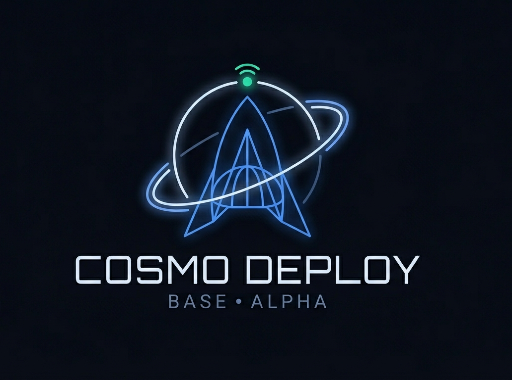
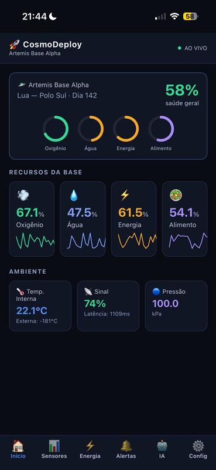
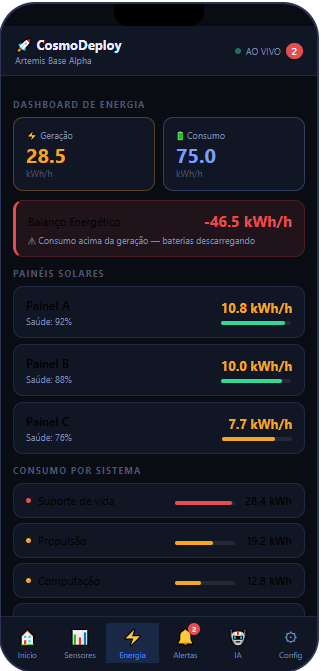
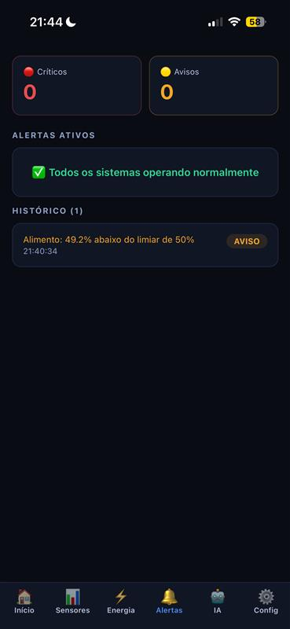
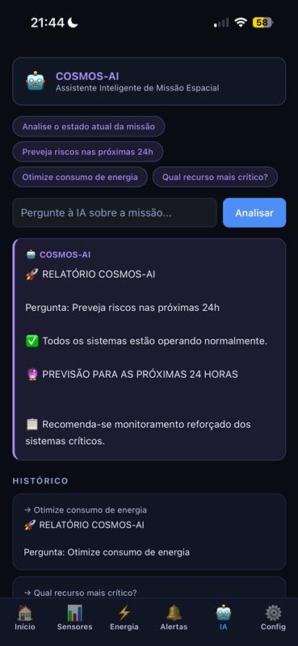
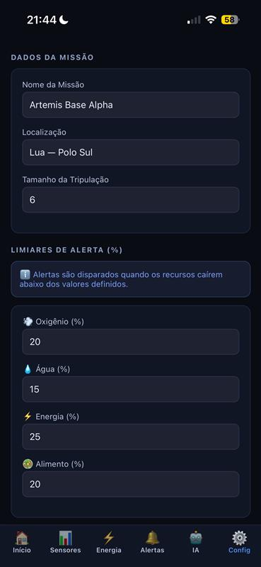

# 🚀 CosmoDeploy
### Global Solution 2026.1 — Cross-Platform Application Development | FIAP

<p align="center">
  
</p>

## Descrição

O CosmoDeploy é um aplicativo de monitoramento inteligente para missões espaciais, desenvolvido para acompanhar recursos críticos da missão, como oxigênio, água, energia, temperatura e comunicação em tempo real. A solução busca auxiliar a tomada de decisão dentro do contexto de Space Predictive Analytics, utilizando dashboards interativos, análise preditiva e geração automática de alertas. Seu diferencial está na combinação entre simulação dinâmica de sensores, monitoramento visual dos sistemas da missão e suporte de IA para antecipação de riscos e otimização operacional.

## 🧑‍💻 Equipe

| Nome | RM |
|------|----|
| Guilherme Vasques Tamai | RM563276 |
| Caio Castelão Carminato | RM563630 |
| Vitor Komura de Freitas | RM563694 |

## 📸 Telas do Aplicativo

### Home — Dashboard Principal



Visão geral da missão espacial contendo indicadores gerais de saúde da base, recursos críticos, temperatura, pressão, comunicação e monitoramento dos principais sistemas em tempo real.

---

### Dashboard de Sensores


Tela dedicada à análise dos sensores da missão, apresentando gráficos dinâmicos, histórico de leituras simuladas e monitoramento contínuo dos sistemas críticos.

---

### Dashboard de Energia



Dashboard responsável pelo acompanhamento energético da missão, exibindo geração dos painéis solares, consumo dos sistemas, balanço energético e distribuição de recursos.

---

### Alertas



Central de alertas automáticos gerados a partir dos limiares configurados, exibindo criticidade, histórico de eventos e monitoramento contínuo dos recursos.

---

### Assistente IA / Análise Preditiva



Módulo de inteligência artificial responsável por fornecer análises preditivas, recomendações operacionais e suporte à tomada de decisão durante a missão.

---

### Configurações / Formulário



Tela utilizada para configuração da missão, personalização dos limiares críticos, preferências operacionais e gerenciamento das informações da base espacial.

## ⚙️ Funcionalidades

* [x] Dashboard principal com monitoramento em tempo real (simulado)
* [x] Simulação dinâmica de sensores espaciais e telemetria
* [x] Sistema automático de alertas baseado em limiares configuráveis
* [x] Dashboard dedicado para análise energética da missão
* [x] Visualização gráfica da evolução dos recursos e sensores
* [x] Assistente de IA para análise preditiva e recomendações operacionais
* [x] Configuração personalizada da missão e dos limites críticos
* [x] Context API para gerenciamento global do estado da missão
* [x] Navegação multi-telas utilizando Expo Router
* [x] Persistência local de configurações com AsyncStorage
* [ ] Integração com NASA Open API (bônus)

## 🛠️ Tecnologias

- React Native
- Expo
- TypeScript
- Expo Router
- Context API
- AsyncStorage
- React Native SVG
- React Native Chart Kit
- React Hooks
- Expo Notifications
- React Native Reanimated
  
## ▶️ Como Executar

### Pré-requisitos

- Node.js instalado
- Git instalado
- Expo Go instalado no celular (iOS ou Android)

### Instalação

```bash
# Clonar o repositório
git clone https://github.com/GuilhermeTamai/GS1---CPAD.git

# Entrar na pasta do projeto
cd GS1---CPAD

# Instalar dependências
npm install

# Executar projeto
npx expo start
```

### Executando o aplicativo

Após iniciar o Expo:

- Pressione `a` para abrir no Android Emulator
- Pressione `i` para abrir no iOS Simulator (macOS)
- Ou escaneie o QR Code usando o aplicativo Expo Go no celular

## 🎥 Vídeo de Demonstração

[](https://youtube.com/...)

Ou simplesmente:  
[Clique aqui para assistir à demonstração](https://youtube.com/...)

## 📜 Licença

Este projeto foi desenvolvido para fins acadêmicos — **FIAP 2026**.

