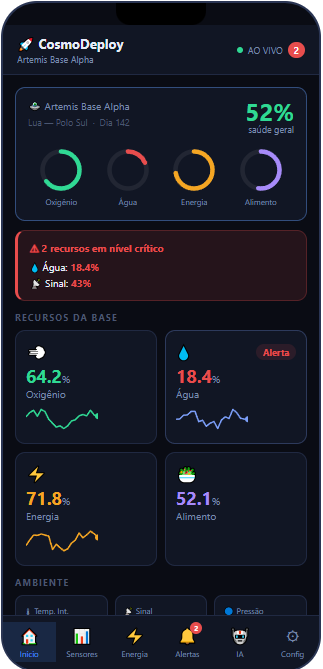
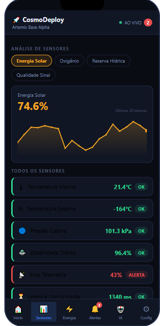
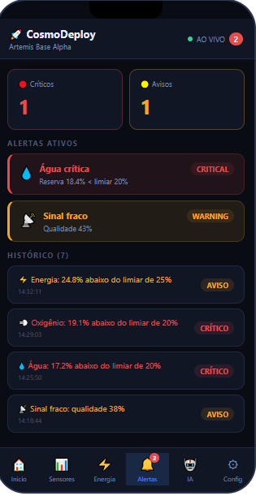
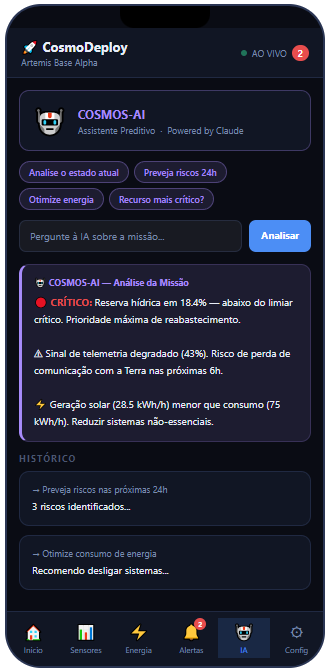
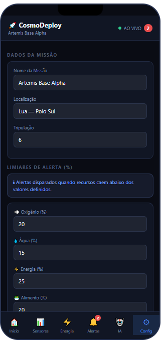

# 🚀 CosmoDeploy
### Global Solution 2026.1 — Cross-Platform Application Development | FIAP

<p align="center">
  
</p>

## Descrição

O CosmoDeploy é um aplicativo de monitoramento inteligente para missões espaciais, desenvolvido para acompanhar recursos críticos da missão, como oxigênio, água, energia, temperatura e comunicação em tempo real. A solução busca auxiliar a tomada de decisão dentro do contexto de Space Predictive Analytics, utilizando dashboards interativos, análise preditiva e geração automática de alertas. Seu diferencial está na combinação entre simulação dinâmica de sensores, monitoramento visual dos sistemas da missão e suporte de IA para antecipação de riscos e otimização operacional.

## 🧑‍💻 Equipe

| Nome | RM |
|------|----|
| Guilherme Vasques Tamai | RM563276 |
| Caio Castelão Carminato | RM563630 |
| Vitor Komura de Freitas | RM563694 |

## 📸 Telas do Aplicativo

| Home — Dashboard Principal | Dashboard de Sensores      | Dashboard de Energia      |
| -------------------------- | -------------------------- | ------------------------- |
|      |  |  |

| Alertas                   | Assistente IA / Análise Preditiva | Configurações / Formulário |
| ------------------------- | --------------------------------- | -------------------------- |
|  |               |    |


## ⚙️ Funcionalidades

## ⚙️ Funcionalidades

* [x] Dashboard principal com monitoramento em tempo real (simulado)
* [x] Simulação dinâmica de sensores espaciais e telemetria
* [x] Sistema automático de alertas baseado em limiares configuráveis
* [x] Dashboard dedicado para análise energética da missão
* [x] Visualização gráfica da evolução dos recursos e sensores
* [x] Assistente de IA para análise preditiva e recomendações operacionais
* [x] Configuração personalizada da missão e dos limites críticos
* [x] Context API para gerenciamento global do estado da missão
* [x] Navegação multi-telas utilizando Expo Router
* [x] Persistência local de configurações com AsyncStorage
* [ ] Integração com NASA Open API (bônus)

## 🛠️ Tecnologias

- React Native + Expo  
- Expo Router  
- AsyncStorage  
- Context API  
- TypeScript  

## ▶️ Como Executar

### Pré-requisitos
- Node.js instalado  
- Expo CLI: `npm install -g expo-cli`  
- Expo Go instalado no celular (iOS ou Android)  

### Instalação
```bash
git clone https://github.com/GuilhermeTamai/GS1---CPAD.git
cd GS1---CPAD
npm install
npx expo start
```
## 🎥 Vídeo de Demonstração

[](https://youtube.com/...)

Ou simplesmente:  
[Clique aqui para assistir à demonstração](https://youtube.com/...)

## 📜 Licença

Este projeto foi desenvolvido para fins acadêmicos — **FIAP 2026**.

